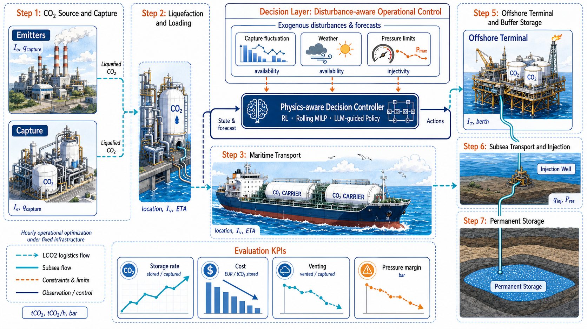

<h1 align="center">
  
</h1>
<h3 align="center">
Physical Simulation, Optimal Control, and Reinforcement Learning for Ship-Based CCS Dispatch
</h3>
<p align="center">
  Languages: English | <a href="README_CN.md">简体中文</a>
</p>

<p align="center">
  
</p>

**CCS_RL** is a research codebase for ship-based CO2 capture, transport, terminal
receiving, pipeline transfer, and offshore injection. It uses Northern Lights as
the primary reference scenario and is built around one design principle: a clean
separation between a **physical layer** (`Simulation/`) that is the single source
of physical truth, and an **algorithm layer** (`algorithms/`) that only decides
*which operating goal to pursue*.

The physical chain is:

```text
Emitter -> Vessel -> Terminal -> Pipeline -> SubseaManifold -> InjectionWell -> Reservoir
```

`Simulation/` advances the network one physical hour at a time; it validates
actions and produces the realised storage, venting, cost, emissions, and pressure
state. `algorithms/` sits above it: a sparse high-level policy chooses a
`DispatchGoal`, and a low-level executor turns that goal into the native action
that `Simulation.environment.CCSEnv` accepts. The physical `network.step()` and
its validation always remain the final feasibility check.

## Architecture

The recommended control split keeps the RL policy from bypassing physics or
having to learn a low-level action for every simulation hour:

```text
Sparse high-level decision  (RL, heuristic, or MILP/MPC planner)
        |  DispatchGoal: emitter<->vessel preference, well-rate target, replan horizon
        v
Low-level executor          (rule, native MPC, or rolling MILP)
        |  native action: {vessels: [...], wells: [...]}
        v
Simulation.environment -> simulator -> physical constraints + reward
```

`algorithms/contracts.py` defines this boundary without tying it to
Stable-Baselines3, CPLEX, or a particular MPC implementation, so the same
physical scenario can be run with rules, MPC, RL, or hybrids and compared fairly.

## Highlights

- **Physics as the single source of truth:** All proposed actions are executed
  and checked by `Simulation/`; the algorithm layer never re-implements physical
  capacities, pressure equations, or clipping rules.
- **Solver-independent goal/executor contract:** `DispatchGoal`, `HighLevelPolicy`,
  and `ActionExecutor` in `algorithms/contracts.py` decouple *what goal* from
  *how it is executed and validated*.
- **Hybrid controllers:** Goal-aware rule executor, replay-validated native MPC
  executor, and a rolling-MILP optimisation baseline (`algorithms/hybrid/`).
- **Several RL families:** High-level sparse-decision PPO, event-triggered
  residual PPO, masked residual PPO v2 with rule-counterfactual rewards and
  curriculum learning, and a risk-gated adaptive-greedy variant (v3).
- **Fair-comparison harness:** `experiments/` scripts sample one disturbance
  trajectory per seed, deep-copy it into every controller, and assert identical
  cumulative capture before accepting a result.
- **Reproducible scenarios and disturbances:** `data/scenarios/` JSON scenarios
  plus capture outages, maintenance, wave-height sea states, and vessel-speed
  effects in `Simulation/scenario_generation/`.

## Roadmap

- [x] Physical entities, operation modules, and single-step network settlement.
- [x] Northern Lights Phase 1/Phase 2 and derived scenario configurations.
- [x] Action proposal/resolver protocol layer.
- [x] Solver-independent goal/executor contracts (`algorithms/contracts.py`).
- [x] Hybrid rule, native-MPC, and rolling-MILP executors.
- [x] High-level sparse-decision PPO with event-triggered decisions.
- [x] Residual PPO v1 (7-action intervention over a safe rule dispatcher).
- [x] Masked residual PPO v2 (dynamic masks + persistent rule-counterfactual reward + curriculum).
- [x] Risk-gated adaptive-greedy residual variant (v3) and risk-gate sweep.
- [x] Strictly paired shared-scenario comparison harness.
- [ ] Unified experiment configuration files and a single CLI entry point.
- [ ] Package large external datasets and trained model weights as release assets.
- [ ] Add project packaging metadata (`pyproject.toml`) and a pinned environment file.
- [ ] Retire the legacy `Simulation/training/train.py` entry point in favour of `algorithms/rl`.

## Requirements

- Python `>= 3.10` (development uses 3.12).
- Core physical layer: `numpy`, `CoolProp`, `searoute`.
- Control / RL: `gymnasium`, `stable-baselines3`, `sb3-contrib`, `torch`.
- Optional MILP baselines: a MILP solver (CBC via PuLP, or CPLEX for the faster
  rolling-MILP studies).

The repository does not yet ship packaging metadata, so `Simulation/` and
`algorithms/` are used as top-level packages directly from the repository root.

## Installation

Install the dependencies into your environment (conda or venv), then run all
commands from the repository root so `Simulation` and `algorithms` resolve as
top-level packages.

```powershell
pip install numpy CoolProp searoute gymnasium stable-baselines3 sb3-contrib torch
```

If a command cannot find the packages, add the repository root to `PYTHONPATH`:

```powershell
$env:PYTHONPATH = "$PWD"
```

## Quick Start

All entry points are Python modules run from the repository root.

### Hybrid controller comparison (rule vs native MPC)

```powershell
python experiments\compare_hybrid_controllers.py `
  --scenario northern_lights_phase1_3vessels `
  --seeds 1 2 3 4 5 `
  --episode-hours 168 `
  --planning-horizon-hours 72
```

Add the rolling MILP explicitly when a solver budget is available:

```powershell
python experiments\compare_hybrid_controllers.py `
  --scenario northern_lights_phase1_3vessels `
  --seeds 1 2 3 4 5 --episode-hours 720 `
  --controllers rule native_mpc rolling_milp `
  --planning-horizon-hours 168 --milp-time-limit-seconds 30
```

Results are written to `output/hybrid_controller_comparison/` as raw/summary CSV
and a metadata JSON. The script refuses to overwrite existing results unless you
pass `--overwrite`.

### High-level sparse-decision PPO

```powershell
python -m algorithms.rl.train_high_level_ppo `
  --scenario northern_lights_phase1_3vessels `
  --episode-hours 720 --decision-interval-h 24 --event-triggered `
  --ent-coef 0.01 --timesteps 50000 --seed 0 --progress-mode lines

python -m algorithms.rl.evaluate_high_level_ppo `
  --run-dir logs\high_level_rl\YOUR_RUN_DIRECTORY `
  --seeds 1 2 3 4 5
```

Training artifacts (config, live status, metrics, checkpoints, final model) are
written under `logs/high_level_rl/`.

### Residual PPO v1 (intervention over a safe rule dispatcher)

```powershell
python -m algorithms.residual_rl.train_residual_ppo `
  --scenario northern_lights_phase1_3vessels `
  --episode-hours 720 --forecast-context-hours 168 --decision-interval-h 24 `
  --timesteps 100000 --num-envs 4 --vec-env subproc `
  --hard-scenario-probability 0.30 --validation-every-steps 5000 `
  --seed 0 --device cpu

python -m algorithms.residual_rl.evaluate_residual_ppo `
  --run-dir logs\residual_rl\<run_name> --model best `
  --seeds 1 2 3 4 5 --hard-scenario-probability 0
```

### Masked residual PPO v2 (rule-counterfactual reward + curriculum)

```powershell
# static hard-scenario mix
python -m algorithms.residual_rl_v2.train_masked_residual_ppo `
  --scenario northern_lights_phase1_3vessels `
  --episode-hours 720 --forecast-context-hours 168 --decision-interval-h 24 `
  --timesteps 20000 --num-envs 4 --vec-env subproc `
  --hard-scenario-probability 0.30 --validation-every-steps 2000 --seed 0 --device cpu

# curriculum learning
python -m algorithms.residual_rl_v2.train_curriculum_masked_residual_ppo `
  --scenario northern_lights_phase1_3vessels `
  --episode-hours 720 --forecast-context-hours 168 --decision-interval-h 24 `
  --timesteps 40000 --curriculum-stages 0.00:0.00 0.20:0.15 0.40:0.30 0.70:0.50 `
  --num-envs 4 --vec-env subproc --validation-every-steps 5000 --seed 0 --device cpu
```

Before training you can enumerate every unmasked intervention along the rule
trajectory to confirm learnable, positive actions exist:

```powershell
python -m algorithms.residual_rl_v2.validate_interventions `
  --seeds 1 4 --scenario northern_lights_phase1_3vessels `
  --episode-hours 720 --forecast-context-hours 168 --decision-interval-h 24 `
  --output-dir output\residual_action_validation_v2\<experiment_name>
```

### Risk-gated residual v3 (adaptive-greedy interventions)

Sweep adaptive risk gates using a frozen v2 MaskablePPO policy:

```powershell
python -m algorithms.residual_rl_v3.sweep_risk_gate `
  --run-dir logs\residual_rl_v2\<run_name> --model best `
  --output-dir output\residual_action_validation_v2\<experiment_name>
```

### Strictly paired shared-scenario comparison

Each of these samples one `720 h + 168 h` disturbance trajectory per seed, deep-
copies it into every controller, runs only the first 720 h, and asserts equal
cumulative capture before reporting:

```powershell
python experiments\compare_shared_scenario_controllers.py `
  --scenario northern_lights_phase1_3vessels --seeds 1 2 3 4 5 `
  --episode-hours 720 --forecast-context-hours 168 `
  --controllers rule ppo rollout_mpc `
  --ppo-run-dir logs\high_level_rl\<run_name> `
  --output-dir output\fair_controller_comparison\<experiment_name>

python experiments\compare_shared_masked_residual_v2.py `
  --run-dir logs\residual_rl_v2\<run_name> --model best `
  --scenario northern_lights_phase1_3vessels --seeds 1 2 3 4 5 `
  --episode-hours 720 --forecast-context-hours 168 `
  --replan-hours 24 --planning-horizon-hours 168 `
  --controllers rule masked_residual_v2 rollout_mpc `
  --output-dir output\fair_controller_comparison\<experiment_name>
```

## Repository Layout

```text
CCS_RL/
|-- Simulation/     # Physical layer: the single source of physical truth
|-- algorithms/     # Algorithm layer: goals, executors, and RL policies
|-- experiments/    # Reproducible, strictly paired controller comparisons
|-- data/           # Scenario JSON, capture-rate profiles, external references
|-- logs/           # Training runs (high_level_rl, residual_rl, residual_rl_v2)
|-- output/         # Comparison and validation outputs
|-- assets/         # Logo and figures
|-- README.md
`-- README_CN.md
```

## `Simulation` Package

```text
Simulation/
|-- entities/              # Emitter, vessel, terminal, pipeline, manifold, well, storage, state
|-- actions/              # Action protocol, action frame, entity-level resolution
|-- operations/           # Capture, loading, transport, unloading, injection, pressure limits
|-- environment/          # CCSEnv, factories, forecast, Gymnasium/SB3 adapters
|-- control/              # Baselines, rule-based, MILP, MPC, demonstrations, imitation
|-- scenario_generation/  # Disturbance generation + wave-height sea-state submodule
|-- training/             # Legacy PPO training entry point (superseded by algorithms/rl)
|-- visualization/        # Dashboard payloads and HTML rendering
|-- economics.py          # Cost, carbon price, vent penalty, storage revenue
|-- metrics.py            # Rollouts, KPIs, and evaluation summaries
|-- network.py            # Physical network graph and single-step settlement
|-- network_scenarios.py  # Build Northern Lights networks from JSON/data
|-- routes.py             # Lon/lat, sea routes, and great-circle distances
|-- ship_speed.py         # Sea-state (wave height) to vessel-speed factor
`-- simulator.py          # High-level simulation runner
```

## `algorithms` Package

```text
algorithms/
|-- contracts.py          # DispatchGoal, HighLevelPolicy, ActionExecutor, replan schedule
|-- evaluation.py         # Physical rollout evaluator for fair controller comparison
|-- hybrid/               # Goal-aware rule / native-MPC / rolling-MILP executors
|-- rl/                   # High-level sparse-decision PPO (Discrete(192), event-triggered)
|-- residual_rl/          # Event-triggered residual PPO (7-action) over a safe rule default
|-- residual_rl_v2/       # Masked residual PPO: dynamic masks, rule-counterfactual reward, curriculum
`-- residual_rl_v3/       # Risk-gated adaptive-greedy residual variant and risk-gate sweep
```

## Data

Some external data files are large and are not fully tracked in git. Place them
back into the corresponding directories before running related scripts.

- `data/scenarios/`: reproducible scenario JSON — `northern_lights_phase1`,
  `northern_lights_phase1_2well`, `northern_lights_phase1_3vessels`,
  `northern_lights_phase1_milkrun`, `northern_lights_phase1_milkrun_imbalanced`,
  `northern_lights_phase2`, `milk_run_stress`, and `toy`.
- `data/capture_rates/`: emitter capture-rate profiles and metadata.
- `data/Others/`: curated external references, e.g. Climate TRACE source mapping
  and monthly emission profiles for the three reference emitters.

## Fair Comparison

Reward values are **not** comparable across controller families: PPO uses a
shaped high-level reward while rule/MPC use the simulator reward. A fair
evaluation always uses realised **stored_t**, **vented_t**, operating/total cost,
unit storage cost, storage/vent rate, wall-clock time, and physical-violation
counts — never a solver's planned objective alone. Every comparison script fixes
the scenario, seed, and forecast for every controller and asserts identical
cumulative capture before accepting a seed.

## Module Documentation

Each package and subpackage carries its own bilingual README with detailed
interfaces, data flow, and constraints:

- [`Simulation/README.md`](Simulation/README.md) and its subdirectory READMEs
- [`algorithms/README.md`](algorithms/README.md)
- [`algorithms/hybrid/README.md`](algorithms/hybrid/README.md)
- [`algorithms/rl/README.md`](algorithms/rl/README.md)
- [`algorithms/residual_rl/README.md`](algorithms/residual_rl/README.md)
- [`algorithms/residual_rl_v2/README.md`](algorithms/residual_rl_v2/README.md)
- [`experiments/README.md`](experiments/README.md)
- [`Simulation/scenario_generation/wave_height/README.md`](Simulation/scenario_generation/wave_height/README.md)

## Citation

If you use this repository in a paper or report, please cite:

```bibtex
@software{ccs_rl,
  title  = {CCS_RL: Ship-Based CCS Dispatch Simulation and Reinforcement Learning},
  author = {CCS_RL contributors},
  year   = {2026},
  note   = {Research code for physical-layer CCS simulation, hybrid control, and reinforcement learning}
}
```

⭐ **If you find this work useful, please star the repository!**
