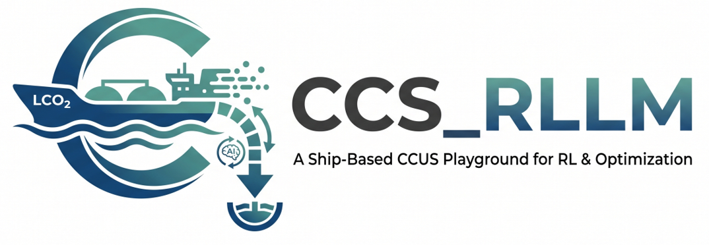
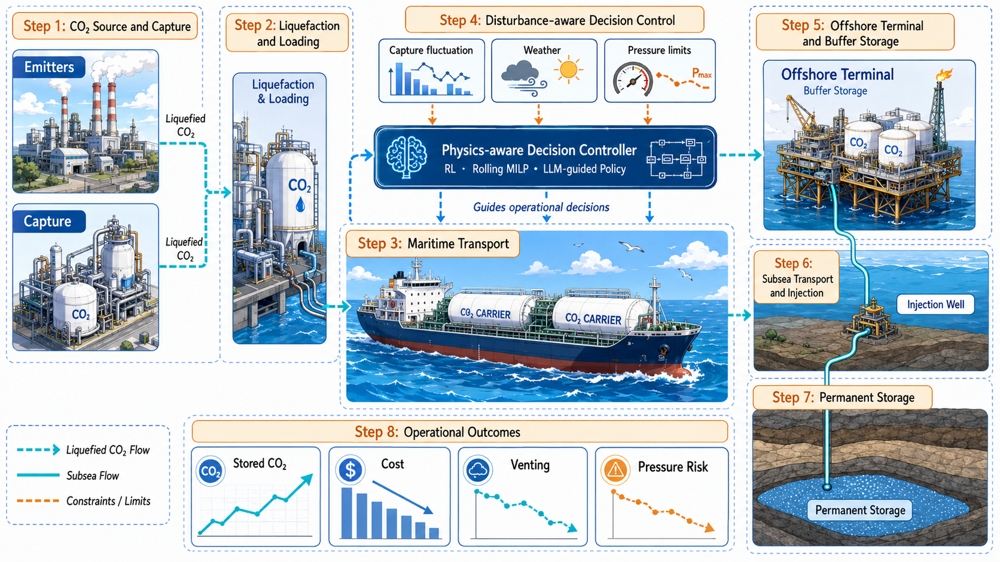

<h1 align="center">
  
</h1>
<h3 align="center">
A Physical Simulation, Optimization Control, and Reinforcement Learning Playground for Ship-Based CCUS Chains
</h3>
<p align="center">
  Languages: English | <a href="README_CN.md">简体中文</a>
</p>

<p align="center">
  <a href=""></a>
  <a href=""></a>
  <a href=""></a>
  <a href="./LICENSE"></a>
  <a href=""></a>
</p>

<h3 align="center">🎉 First version of CCUS operations optimization 🎉</h3>

<p align="center">
  
</p>
CCS_RLLLM is a modular research codebase for ship-based carbon capture, transport, terminal receiving, pipeline transfer, and injection workflows. The current implementation uses Northern Lights as the primary reference scenario and brings physical-layer simulation, action protocols, rule-based controllers, MILP/MPC, RL environments, disturbance generation, and visualization dashboards into one reproducible experiment framework.

The core chain is:

```text
Emitter -> Vessel -> Terminal -> Pipeline -> SubseaManifold -> InjectionWell -> Reservoir
```

High-level controllers, MILP solvers, RL policies, or experiment scripts submit actions. The physical layer validates those actions, advances vessel movement, updates capture, inventory, unloading, transport, injection, and pressure states, and returns auditable trajectories and KPIs.

## Highlights

- **End-to-end CCUS logistics simulation:** Covers emitters, LCO2 vessels, terminals, pipelines, subsea manifolds, injection wells, and reservoirs.
- **Decoupled action protocol and physics layer:** `sim.actions` defines action representation and resolution, while `sim.control` focuses on control decisions.
- **Multiple controller families:** Includes idle/greedy baselines, rule-based controllers, static MILP benchmarks, rolling MILP/MPC, and RL policies.
- **Reproducible scenarios:** `scenarios/` stores Northern Lights Phase 1/Phase 2 JSON scenarios, and `data/capture_rates/` stores capture-rate profiles.
- **Disturbance and weather modeling:** Includes capture outages, injectivity decline, maintenance, wave-height scenarios, and vessel-speed effects.
- **Training and evaluation loop:** Provides a Gymnasium/SB3 adapter, PPO/BC training scripts, controller comparison experiments, and HTML dashboard outputs.

## Roadmap

- [x] Physical entities, operation modules, and network step.
- [x] Northern Lights Phase 1/Phase 2 scenario configuration.
- [x] Action proposal/resolver protocol layer.
- [x] Rule-based, MILP, and rolling MILP/MPC controllers.
- [x] Gymnasium/SB3 RL environment and training entry points.
- [x] Controller comparison, KPI aggregation, and dashboard generation.
- [x] Wave-height scenarios, prediction models, and vessel-speed disturbances.
- [ ] Unified experiment configuration files and CLI entry points.
- [ ] Package large external datasets and model weights as downloadable release assets.
- [ ] Move `economics.py` and `metrics.py` into an evaluation package.
- [ ] Replace personal paths in HPC scripts with environment-variable configuration.

## Environment Requirements

- Python `>=3.10`; the current GPU training environment uses Python 3.12.
- `uv` for dependency resolution, virtual environment creation, and script execution.
- Core physical-layer dependencies: `searoute>=1.6`, `CoolProp>=6.6`.
- Optional RL dependencies: `numpy`, `gymnasium`, `stable-baselines3`, `sb3-contrib`.
- Wave-height GPU training dependencies: `torch`, `torchvision`, `torchaudio`, `pandas`, `scikit-learn`, `matplotlib`, `tqdm`, `jupyterlab`.
- NVIDIA GPU and a matching CUDA/PyTorch environment are recommended for deep learning training.

## Installation

Run all commands from the repository root.

### CPU / Basic Setup

```powershell
uv sync
uv run python -m pip install -e .
```

For the RL environment:

```powershell
uv sync --extra rl
uv run python -m pip install -e ".[rl]"
```

If you do not use `uv`, install with pip:

```powershell
pip install -e .
pip install -e ".[rl]"
```

### GPU / Wave-Height Training Environment

The wave-height prediction models are best run in the conda environment:

```powershell
conda env create -f environment-gpu.yml
conda activate ccs-rlllm-gpu
pip install -e ".[rl]"
```

## Quick Start

### Physical-Layer Demo

```powershell
uv run python examples\run_physical_layer_demo.py
```

### Dashboards

```powershell
uv run python examples\build_phase1_dashboard.py
uv run python examples\build_rule_based_dashboards.py
```

Generated HTML or image artifacts are written to the script-defined `output/` or visualization directories.

### Controller Comparison

```powershell
uv run python experiments\compare_controllers_same_scenarios.py
```

This experiment compares episode controllers under the same disturbance scenarios and writes CSV/report outputs. Static MILP is reported separately as a perfect-foresight benchmark.

### RL Training

```powershell
uv run python -m sim.train --timesteps 200000
```

Full PPO/BC training entry point:

```powershell
uv run python scripts\train_ppo_bc.py --weather-obs --bc-episodes 30 --bc-epochs 20 --timesteps 150000
```

### Wave-Height Prediction

```powershell
uv run python -m sim.scenario_generation.wave_height.prediction.train_lstm
uv run python -m sim.scenario_generation.wave_height.prediction.train_gru
```

See `src/sim/scenario_generation/wave_height/prediction/README.md` for details.

## Reinforcement Learning & LLM Experiments

The `scripts/` directory holds the RL + LLM research stack. A full write-up of the
findings (RL matching greedy, milk-run headroom, LLM planning, goal-conditioned
generalization) is in [`docs/experiments_summary.md`](docs/experiments_summary.md).

### Behaviour cloning + PPO (kickstarting)

Warm-start a MaskablePPO policy from a demonstrator (greedy or a load-balanced
cluster), then fine-tune with a decaying BC anchor:

```powershell
uv run python scripts\train_ppo_bc.py --scenario northern_lights_phase1_milkrun_imbalanced `
  --teacher cluster --carbon-price 80 --bc-episodes 30 --bc-epochs 20 `
  --kickstart-coef 1.0 --timesteps 150000
```

Key flags: `--scenario` (any registered scenario), `--teacher {greedy,cluster}`,
`--carbon-price` (symmetric store credit = vent tax), `--kickstart-coef`,
`--weather-obs`, `--injection-reward-eur-per-t`.

### Goal-conditioned RL (zero-shot generalization)

Train one policy across randomized capture-imbalance layouts, conditioned on a
per-vessel emitter assignment, then evaluate on a **held-out** layout:

```powershell
uv run python scripts\train_goal_conditioned.py --bc-episodes 48 --timesteps 200000 `
  --kickstart-coef 1.0 --outage-rate 0.5 --outage-hours 12
```

### LLM planning (local Qwen / Llama via Ollama)

```powershell
winget install Ollama.Ollama
ollama pull qwen2.5:7b-instruct
ollama pull llama3.1:8b
```

- `scripts\llm_planner.py` — the LLM produces a high-level vessel→emitter
  assignment executed by a deterministic cluster policy (hierarchical planning).
- `scripts\llm_router.py` — the LLM picks the destination at each dispatch step.
- `scripts\eval_llm_goal.py` — LLM vs heuristic as the goal source for the
  goal-conditioned policy.

```powershell
uv run python scripts\llm_planner.py --model qwen2.5:7b-instruct `
  --scenario northern_lights_phase1_milkrun_imbalanced
```

### Evaluation and ceiling

```powershell
uv run python scripts\eval_ppo_model.py output\rl_ppo\<model>.zip
uv run python scripts\eval_milp_ceiling.py --seeds 101 102   # rolling-MILP reference
```

### Milk-run scenarios

`northern_lights_phase1_milkrun` (2 vessels, 3 spread emitters) and
`northern_lights_phase1_milkrun_imbalanced` (imbalanced capture) make greedy
source selection suboptimal, creating routing headroom for learning / LLM
planning to exploit.

## Tests

```powershell
uv run python -m unittest discover -s tests
```

If running without an editable install, set the source path explicitly:

```powershell
$env:PYTHONPATH="$PWD\src"
python -m unittest discover -s tests
```

## Repository Layout

```text
CCS_RLLLM/
|-- data/                 # Capture-rate profiles, external references, experiment data
|-- docs/                 # Research notes, design docs, and historical ideas
|-- examples/             # Small demos and dashboard builders
|-- experiments/          # Research experiment entry points
|-- hpc/                  # Cluster submission scripts and smoke tests
|-- scenarios/            # Reproducible scenario JSON files
|-- scripts/              # PPO/BC training and model evaluation scripts
|-- src/sim/              # Main Python package
|-- tests/                # Unit, structure, and experiment smoke tests
|-- visualisation html/   # Legacy visualization artifact directory
|-- environment-gpu.yml   # GPU training environment
|-- pyproject.toml        # Python package and dependency configuration
|-- uv.lock               # uv lock file
`-- README.md
```

## `src/sim` Structure

```text
src/sim/
|-- actions/              # ActionProposal, ActionFrame, ActionResolver
|-- control/              # Baselines, rule-based, MILP, rolling MILP, imitation
|-- entities/             # Emitter, vessel, terminal, pipeline, well, state
|-- environment/          # CCSEnv, factories, Gymnasium/SB3 adapter
|-- operations/           # Capture, loading, unloading, transport, injection
|-- scenario_generation/  # Disturbance and wave-height scenario generation
|-- visualization/        # Dashboard payloads, HTML rendering, writer entry points
|-- economics.py          # Cost and revenue model
|-- line_source.py        # Reservoir/well pressure line-source model
|-- metrics.py            # Rollouts, KPIs, and evaluation summaries
|-- network.py            # Physical network graph and single-step settlement
|-- network_scenarios.py  # Build Northern Lights networks from JSON/data
|-- routes.py             # Route and distance calculation
|-- ship_speed.py         # Sea-state effects on vessel speed
|-- simulator.py          # High-level simulation runner
`-- train.py              # RL training entry point
```

## Data

Some external data files are large and are not fully tracked in git. Download them and place them back into the corresponding data directories before running related scripts.

- Google Drive data folder: <https://drive.google.com/drive/folders/147lfZ1M1d3Am0v65fk1SX0jsXmk2lVzN?usp=sharing>
- `scenarios/`: reproducible scenario JSON files such as `northern_lights_phase1.json` and `northern_lights_phase2.json`.
- `data/capture_rates/`: Phase 1/Phase 1+ emitter capture-rate profiles and metadata.
- `data/网络收集资料/`: curated external references, such as Climate TRACE source mapping and monthly profiles.

## Main Workflows

### Add a Controller

1. Implement the control logic in `src/sim/control/`.
2. Express actions with `ActionProposal` / `ActionFrame`.
3. Route actions through `ActionResolver` into `network.step()`.
4. Register evaluation in `experiments/compare_controllers_same_scenarios.py` or a new experiment script.
5. Add behavior tests or smoke tests under `tests/`.

### Add a Scenario

1. Add a JSON configuration under `scenarios/`.
2. If a new capture profile is required, place it under `data/capture_rates/`.
3. Add a loading entry point in `src/sim/network_scenarios.py` or an environment factory.
4. Validate with a demo, controller comparison, or dashboard script.

### Add a Disturbance

1. Generate the episode time series in `src/sim/scenario_generation/generator.py`.
2. Define runtime resolution rules in `disturbance_resolver.py`.
3. Connect the disturbance to `CCSEnv` or the relevant physical operation module.
4. Add fixed-seed tests to keep experiments reproducible.

## Related Documentation

- [`docs/experiments_summary.md`](docs/experiments_summary.md) — RL + LLM experiment results and conclusions
- `docs/CCS_RL_Research_Core_Idea.md`
- `docs/previous ideas/northern_lights_development_plan_cn.md`
- `docs/previous ideas/northern_lights_mechanism_ladder_L0_L3plus_cn.md`
- `src/sim/scenario_generation/wave_height/prediction/README.md`

## Citation

If you use this repository in a paper or report, please cite:

```bibtex
@software{ccs_rlllm,
  title  = {CCS_RLLLM: Ship-Based CCUS Logistics Simulation and RL Playground},
  author = {CCS_RLLLM contributors},
  year   = {2026},
  note   = {Research code for physical-layer CCUS simulation, control, and reinforcement learning}
}
```
