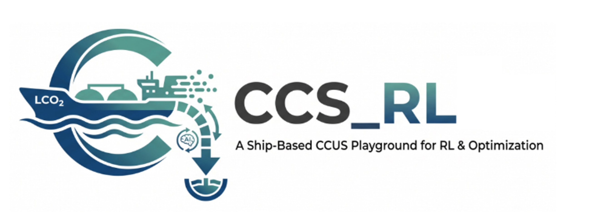
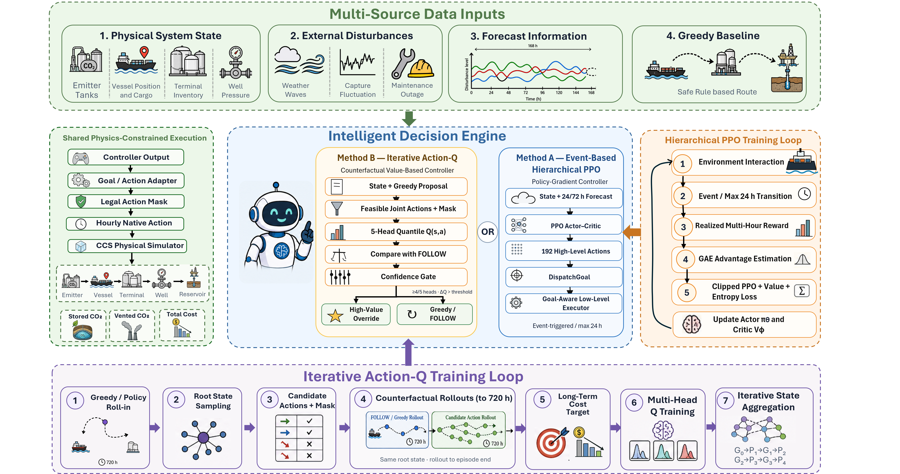
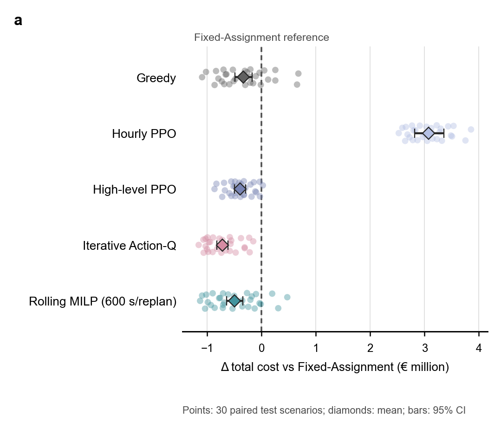

<div align="center">
  

  <h3>Physics-Constrained Simulation and Learned Dispatch Control<br/>for Ship-Based CCS Chains</h3>

  <p>
    <a href="./LICENSE"></a>
    =3.10">
    
    
    
    <a href="https://drive.google.com/drive/folders/147lfZ1M1d3Am0v65fk1SX0jsXmk2lVzN"></a>
    <a href="https://colab.research.google.com/github/ZZZPhaethon/CCS_RL/blob/main/examples/colab_vessel_trajectory_demo.ipynb"></a>
    <a href="https://zzzphaethon.github.io/CCS_RL/"></a>
  </p>

  <p>
    <a href="README.md">English</a> · <a href="README_CN.md">简体中文</a>
  </p>

  <p>
    <b>One simulator. One frozen protocol. Heuristics, MILP and learned controllers compared under the same physics.</b>
  </p>
</div>

<p align="center">
  
</p>

`CCS_RL` is a research codebase for **hourly operational dispatch of ship-based CO₂
transport and storage**. It couples an auditable, physics-constrained simulator with
heuristics, rolling optimisation and reinforcement-learning controllers. Every controller
acts through the same legal-action interface and is replayed by the same physical engine.

The current main method, **Iterative Action-Q**, keeps Greedy as a safe default and learns
when a small number of high-value dispatch interventions are worth making.

### ✨ Highlights

- **End-to-end physical chain.** Capture, liquefaction, vessel transport, offshore buffer
  storage, pipeline flow, injection-well limits and reservoir pressure are settled hourly.
- **Counterfactual long-horizon control.** Candidate dispatch actions are labelled by rolling
  the same decision state to the end of the 720 h episode—not by a one-step reward.
- **Shared physics and accounting.** All methods use the same action masks, disturbances,
  automatic well rule, cost ledger and terminal cleanup value.
- **Multiple controller families.** Fixed assignment, Greedy, three PPO formulations,
  Iterative Action-Q, Rolling MILP and a time-limited full-horizon MILP reference.
- **Artifact-backed evaluation.** The repository contains machine-readable protocols,
  per-seed outputs, source data, figures and aggregate tables for E0–E5.
- **Strong current result.** Across three trained model seeds and 30 evaluation scenarios,
  Iterative Action-Q reaches **€1.882M mean total cost**, **€372.5k below Greedy**, with
  **84.7% less venting**.

> [!IMPORTANT]
> The evaluation block `9,000,031–9,000,060` is fully reported, but model seed 0 of
> Iterative Action-Q participated in a model-adoption decision. These artifacts are therefore
> formal and reproducible, but the block must not be described as a pristine untouched
> holdout. See the [E1 provenance note](experiments_results/E1/README.md).

---

## 📖 Table of contents

- [Research question](#-research-question)
- [System and method](#-system-and-method)
- [Unified evaluation protocol](#-unified-evaluation-protocol)
- [Main results](#-main-results)
- [What the ablations say](#-what-the-ablations-say)
- [Quick start](#-quick-start)
- [Reproducing experiments](#-reproducing-experiments)
- [Repository layout](#-repository-layout)
- [Documentation and artifacts](#-documentation-and-artifacts)
- [Roadmap](#-roadmap)
- [Citation](#-citation)

## 🚀 Updates

- **2026-07-30** — Published the complete project snapshot with E0–E5 artifacts,
  paper protocols, figures, tables and provenance records.
- **2026-07-29** — Completed the seven-controller E1 comparison over scenarios
  `9,000,031–9,000,060`, including three model seeds for every learned controller.
- **2026-07-29** — Completed E2 iteration, E3 future-information and E4 stress
  evaluations with matched budgets and paired scenarios.
- **2026-07-27** — Locked the Iterative Action-Q production configuration and
  reproducibility checks.

## 💡 Research question

> In a three-vessel CCS transport–storage system with weather, capture and
> injection-capacity disturbances, can a controller that retains Greedy as its safe
> default and learns a small number of high-value interventions reduce cost and CO₂
> venting at low online decision cost?

The physical chain is:

```text
Emitter → Vessel → Terminal → Pipeline → Subsea Manifold → Injection Well → Reservoir
```

Controllers decide **vessel dispatch only**. Injection is handled by a shared automatic
well controller that takes the highest currently feasible rate. A method cannot gain an
advantage by relaxing mass balance, storage capacity, pressure limits or action legality.

<details>
<summary><b>Research abstract</b></summary>

Ship-based carbon capture and storage couples discrete vessel-routing decisions with
continuous inventories, weather-dependent travel, fluctuating capture, injection
availability and subsurface pressure constraints. This repository studies that operational
control problem with a common physics-constrained simulator and a frozen evaluation
protocol.

Iterative Action-Q starts from a Greedy policy, samples decision states, evaluates feasible
joint actions through counterfactual rollouts to the end of each 720 h episode, and trains a
distributional multi-head action-value model. At deployment, a confidence and economic
margin gate permits only a limited number of learned overrides; otherwise the controller
follows Greedy.

The repository also tests direct hourly PPO, high-level PPO, event-residual PPO and rolling
MILP. The experiments are designed to separate simulator validity (E0), controller
performance (E1), iteration effects (E2), future-information representations (E3),
disturbance robustness (E4) and optimisation references (E5).

</details>

## 🎨 System and method

<div align="center">
  
  <p><i>Shared physics-constrained execution, controller families and the Iterative Action-Q training loop.</i></p>
</div>

### Iterative Action-Q in one view

```text
Greedy states G0        → train P1
P1 roll-in states G1    → train P2 on G0 + G1
P2 roll-in states G2    → train P3 on G0 + G1 + G2
P3 roll-in states G3    → train P4 on all collected states
```

| Component | Design |
|---|---|
| State | Physical system state, Greedy proposal and optional future-information summary |
| Joint action | Up to `6³ = 216` three-vessel combinations, with infeasible actions masked |
| Label | `1e-5 × (Greedy total cost − candidate total cost)` from matched rollouts to 720 h |
| Network | Shared vessel encoder, structured action embeddings, 5 bootstrap heads and 51 quantiles |
| Safe default | `FOLLOW`, which executes the Greedy proposal |
| Deployment gate | Override only when head agreement and economic-gain thresholds are met |
| Intervention budget | Overrides are capped and distributed across fixed episode windows |

Implementation: [`src/sim/control/iterative_action_q.py`](src/sim/control/iterative_action_q.py)<br>
Training specification: [`docs/iterative_action_q_training_zh.md`](docs/iterative_action_q_training_zh.md)

### Shared physical execution

`src/sim/` is the single source of physical truth. It validates actions and advances:

```text
capture → conditioning → loading → sailing → unloading
        → buffer storage → pipeline → injection → reservoir pressure
```

Algorithm-layer controllers may propose goals or actions, but they cannot introduce new
capacities, clipping rules or pressure equations.

## ⚖️ Unified evaluation protocol

The frozen `unified_window_v1` protocol uses three vessels, 720 h episodes and a 1 h
physical step. Initial states, economic parameters, action masks and per-seed disturbance
trajectories are shared.

| Controller | Paper role | Trained | Runtime future information |
|---|---|:---:|---|
| Fixed vessel–emitter split | Fixed-Assignment Heuristic | No | None |
| Dynamic shuttle | Greedy | No | None |
| Direct hourly policy | Hourly Centralized Maskable PPO | Yes | Shared 168 h summary |
| 24 h high-level policy | High-level Centralized Maskable PPO | Yes | Shared 168 h summary |
| Event-triggered residual policy | Event-Residual PPO | Yes | Shared 168 h summary |
| Counterfactual value controller | **Iterative Action-Q** | Yes | Shared 168 h summary |
| Receding-horizon optimisation | Rolling MILP | No | Full hourly 168 h forecast |
| Offline time-limited reference | Full-horizon MILP | No | Perfect information |

Key controls for fairness:

- identical simulator, legal-action mask and automatic-well rule;
- frozen per-seed disturbances and paired scenario comparisons;
- common cost definition and compact terminal cleanup value;
- matched simulator-hour budget for the learned methods;
- three independent training seeds for each learned controller;
- machine-readable protocol and seed manifests.

Protocol files:

- [`unified_window_v1_paper_protocol.json`](experiments/protocols/unified_window_v1_paper_protocol.json)
- [`unified_window_v1_seed_manifest.json`](experiments/protocols/unified_window_v1_seed_manifest.json)
- [`e2_e3_e4_iterative_q_protocol.json`](experiments/protocols/e2_e3_e4_iterative_q_protocol.json)

## 📊 Main results

### E0 — physical validity

E0 validates the simulator and common accounting boundary before comparing controllers.

| Check | Result |
|---|---:|
| Supplementary validation items | **20 / 20 passed** |
| Automated regression tests | **179 / 179 passed** |
| Maximum 720 h mass-balance error | **6.158 × 10⁻⁸ t** |
| Hard physical violations | **0** |
| Validation runtime | **5.53 s** |

Artifacts: [`experiments_results/E0/`](experiments_results/E0/)

### E1 — seven-controller comparison

Mean performance on 30 paired 720 h scenarios. Learned methods aggregate
`3 model seeds × 30 scenarios = 90` episode records. Terminal cleanup is included.

| Method | Mean total cost | Δ vs Greedy | Vented CO₂ | Stored CO₂ | Unit cost | Wins vs Greedy |
|---|---:|---:|---:|---:|---:|---:|
| Fixed-Assignment | €2,586,942 | +€332,730 | 12,120.5 t | 95,578.7 t | €27.23/t | 6 / 30 |
| Greedy | €2,254,212 | — | 7,296.8 t | 102,984.2 t | €22.40/t | — |
| Hourly PPO | €5,659,632 | +€3,405,421 | 49,756.8 t | 44,082.9 t | €136.05/t | 0 / 90 |
| High-level PPO | €2,187,244 | −€66,967 | 3,803.5 t | 107,406.2 t | €20.61/t | 48 / 90 |
| Event-Residual PPO | €2,239,850 | −€14,362 | 5,963.2 t | 102,490.0 t | €22.01/t | 47 / 90 |
| **Iterative Action-Q G60-P4** | **€1,881,692** | **−€372,519** | **1,113.0 t** | **110,246.0 t** | **€17.14/t** | **83 / 90** |
| Rolling MILP | €2,089,728 | −€164,483 | 4,663.2 t | 105,909.6 t | €19.99/t | 16 / 30* |

<sub>*Rolling MILP also ties Greedy on 5/30 scenarios. Its online comparison uses a
168 h horizon, 24 h replanning and a 600 s solver limit per replan.</sub>

Compared with Greedy, Iterative Action-Q reduces the ratio of mean costs by **16.5%**,
reduces venting by **84.7%**, increases stored CO₂ by **7.1%** and lowers unit total cost
by **23.5%**.

<div align="center">
  
  <p><i>Paired scenario cost differences; diamonds show means and bars show 95% confidence intervals.</i></p>
</div>

Source table:
[`e1_formal_per_algorithm.csv`](experiments_results/E1/formal_comparison/e1_formal_per_algorithm.csv)

<details>
<summary><b>Important interpretation notes</b></summary>

- The Full-horizon MILP is an offline perfect-information reference. All 30 runs terminated
  with time-limited feasible incumbents rather than proven optima, so it is not an oracle.
- Rolling MILP is the valid online optimisation comparison; its mean wall time is
  approximately 12,313 s per seed under the reported budget.
- The three learned methods are averaged over model seeds as well as scenarios. Their
  win counts therefore use 90 model-seed/scenario pairs.
- The Iterative Action-Q evaluation block has the model-adoption caveat stated at the top
  of this README.

</details>

## 🔬 What the ablations say

The artifacts include positive and negative findings. The current evidence supports
Iterative Action-Q as a strong controller, but does **not** support every initial design
hypothesis.

### E2 — does iteration help?

| Training stage | Mean cost | Δ vs Greedy | Vented | Wins |
|---|---:|---:|---:|---:|
| P1, Greedy roll-in only | €1,993,324 | −€260,887 | 2,449.4 t | 24 / 30 |
| P2 | €1,950,709 | −€303,503 | 1,971.3 t | 26 / 30 |
| P3 | €1,927,328 | −€326,884 | 1,740.9 t | 27 / 30 |
| **P4** | **€1,881,692** | **−€372,519** | 1,113.0 t | **28 / 30** |
| One-shot, matched budget | €1,885,221 | −€368,991 | **1,069.0 t** | 27 / 30 |

Performance improves monotonically from P1 to P4, but a one-shot Greedy-state model with
a matched simulator budget nearly matches P4. The current experiment therefore shows a
clear **data/budget benefit**, while the incremental benefit of policy-induced iterative
states remains unresolved.

Source: [`table_4_iteration_ablation.csv`](experiments_results/E2/tables/table_4_iteration_ablation.csv)

### E3 — how much future information?

| Representation | Dimensions | Parameters | Mean cost | Δ vs state-only |
|---|---:|---:|---:|---:|
| State only | 94 | 4.319M | €1,885,676 | — |
| **168 h structured summary** | **101** | **4.324M** | **€1,881,692** | −€3,984 |
| Full 168 h sequence | 1,774 | 4.389M | €2,104,128 | +€218,451 |

The compact summary is statistically close to state-only, while the full hourly sequence is
materially worse. More forecast detail is not automatically more useful.

Source:
[`table_5_future_information_ablation.csv`](experiments_results/E3/tables/table_5_future_information_ablation.csv)

### E4 — disturbance stress

| Stress | Greedy | Iterative P4 | P4 Δ vs Greedy | P4 wins |
|---|---:|---:|---:|---:|
| Low | €2,004,612 | €1,748,849 | −€255,763 | 27 / 30 |
| Medium | €2,254,212 | €1,881,692 | −€372,519 | 28 / 30 |
| High | €3,006,460 | €2,586,735 | −€419,725 | 24 / 30 |

The gated controller remains better than Greedy across all three stress levels. The
matched one-shot model is slightly better than P4 at high stress, again cautioning against
attributing all gains to iteration.

Source:
[`table_s2_action_q_stress_comparison.csv`](experiments_results/E4/tables/table_s2_action_q_stress_comparison.csv)

## ⚡ Quick start

### Installation

Run commands from the repository root.

```powershell
uv sync
uv run python -m pip install -e .
```

Install the RL stack:

```powershell
uv sync --extra rl
uv run python -m pip install -e ".[rl]"
```

Without `uv`:

```bash
pip install -e ".[rl]"
```

Additional requirements:

- Python `>=3.10` (GPU experiments use Python 3.12);
- `searoute>=1.6` and `CoolProp>=6.6` for the physical layer;
- PyTorch for Iterative Action-Q and event-based learned controllers;
- IBM ILOG CPLEX for Rolling and Full-horizon MILP experiments.

### Run the physical simulator

```powershell
uv run python examples\run_physical_layer_demo.py
uv run python examples\build_phase1_dashboard.py
uv run python examples\build_rule_based_dashboards.py
```

### Run the tests

```powershell
uv run python -m unittest discover -s tests
```

Without an editable installation:

```powershell
$env:PYTHONPATH="$PWD\src"
python -m unittest discover -s tests
```

## 🧪 Reproducing experiments

### Iterative Action-Q

The production workflow alternates state collection and cumulative retraining.

```powershell
# G0 — collect Greedy root states
uv run python -m experiments.generate_iterative_q_greedy_data `
  --out-path output\iq\g0_train.pt `
  --split train `
  --seeds (1500..1699) `
  --roots-per-seed 12

# P1 — train the first model
uv run python scripts\train_iterative_action_q.py `
  --train-data output\iq\g0_train.pt `
  --validation-data output\iq\g0_val.pt `
  --out-dir output\iq\p1 `
  --observation-input v4_future_24_72

# G1 — collect states visited by the current policy
uv run python -m experiments.create_iterative_q_lock `
  --checkpoint output\iq\p1\iterative_action_q.pt `
  --out-path output\iq\p1\lock.json `
  --protocol-id unified_window_v1 `
  --residual-margin 0.40 `
  --economic-margin-eur 40000

uv run python -m experiments.generate_iterative_q_policy_data `
  --lock-config output\iq\p1\lock.json `
  --out-path output\iq\g1_train.pt `
  --split train `
  --seeds (1500..1539)
```

Repeat the collect/retrain cycle through P4, then evaluate:

```powershell
uv run python -m experiments.evaluate_iterative_action_q `
  --checkpoint output\iq\p4\iterative_action_q.pt `
  --out-dir output\iq\p4\eval
```

### Unified controller comparison

```powershell
uv run python -m experiments.compare_unified_window_controls `
  --iterative-q-checkpoint output\iq\p4\iterative_action_q.pt `
  --v4-run-dir output\event_v4\run1 `
  --out-dir output\comparison
```

The comparison writes per-seed CSV files and a summary JSON containing cost components,
stored/vented tonnes, intervention counts and wall-clock time.

### HPC / Slurm

The launcher wires data generation, staged training and evaluation into one dependency graph.
Inspect the full plan without submitting:

```bash
DRY_RUN=1 bash hpc/launch_iterative_action_q.sh
```

Set `PROJECT_DIR`, `RUN_ROOT` and `CONFIG_NAME` for the target cluster. Launchers refuse
to overwrite an existing run directory and record submitted job IDs for provenance.

## 🗂️ Repository layout

```text
CCS_RL/
├── assets/                 # README and method graphics
├── data/                   # Capture profiles and external reference data
├── docs/                   # Paper plan, method notes and result narratives
├── examples/               # Physical demos and dashboard builders
├── experiments/            # Generation, evaluation, comparison and aggregation
│   └── protocols/          # Frozen machine-readable experiment protocols
├── experiments_results/    # E0–E5 figures, tables, per-seed results and provenance
├── hpc/                    # Slurm launchers and stage-specific submission scripts
├── scenarios/              # Reproducible CCS network configurations
├── scripts/                # Training and analysis entry points
├── src/sim/                # Main simulation and control package
├── tests/                  # Unit, contract, regression and smoke tests
├── environment-gpu.yml     # GPU training environment
└── pyproject.toml
```

### Controller families

```text
src/sim/control/
├── baselines.py                # Idle and Greedy shuttle policies
├── rule_based.py               # Fixed-assignment and rule controllers
├── cplex_milp.py               # CPLEX model backend
├── rolling_milp.py             # Rolling-horizon optimisation
├── native_mpc.py               # Native multi-candidate MPC
├── iterative_action_q.py       # Main distributional Action-Q model
├── hourly_ppo/                 # Direct hourly PPO
└── event_based/
    ├── rl/                     # High-level PPO
    └── residual_rl_v4/         # Event-Residual PPO
```

## 📚 Documentation and artifacts

| Resource | Contents |
|---|---|
| [`docs/paper_structure_zh.md`](docs/paper_structure_zh.md) | Paper argument and section-level evidence requirements |
| [`docs/paper_experiment_plan_zh.md`](docs/paper_experiment_plan_zh.md) | E0–E5 design, fairness rules, metrics and statistics |
| [`docs/iterative_action_q_training_zh.md`](docs/iterative_action_q_training_zh.md) | Method definition and production configuration |
| [`experiments_results/E0/`](experiments_results/E0/) | Physical validity and accounting checks |
| [`experiments_results/E1/`](experiments_results/E1/) | Seven-controller formal comparison |
| [`experiments_results/E2/`](experiments_results/E2/) | Iteration and matched-budget ablation |
| [`experiments_results/E3/`](experiments_results/E3/) | Future-information ablation |
| [`experiments_results/E4/`](experiments_results/E4/) | Disturbance-stress evaluation |
| [`experiments_results/E5/`](experiments_results/E5/) | Time-limited full-horizon MILP artifacts |
| [`docs/preliminary results/`](docs/preliminary%20results/) | Dated development-stage analyses |

Large external data and model weights are not all tracked by Git. Restore them to their
documented directories from the
[project data folder](https://drive.google.com/drive/folders/147lfZ1M1d3Am0v65fk1SX0jsXmk2lVzN).

## 🧭 Roadmap

- [x] Physics-constrained hourly CCS-chain simulator.
- [x] Shared action proposal, resolution and replay interface.
- [x] Heuristic, MILP, MPC and PPO controller families.
- [x] Iterative Action-Q training, gating and evaluation pipeline.
- [x] Frozen `unified_window_v1` protocol and seed manifest.
- [x] E0 physical validation and E1 seven-controller comparison.
- [x] E2–E4 iteration, future-information and stress ablations.
- [x] Versioned source data, figures, tables and provenance artifacts.
- [ ] Run a new untouched confirmatory evaluation block after all model choices are frozen.
- [ ] Package model checkpoints and large datasets as versioned release assets.
- [ ] Replace remaining personal HPC paths with environment-based configuration.
- [ ] Complete the paper and archival release.

## 🤝 Contributing

Issues and pull requests are welcome. When adding a controller:

1. implement it under `src/sim/control/`;
2. express decisions through `ActionProposal` / `ActionFrame`;
3. pass all actions through `ActionResolver` and `network.step()`;
4. register it in the unified comparison;
5. add fixed-seed behavioural tests;
6. create a new protocol version if the physical or disturbance assumptions change.

## 📝 Citation

If this repository supports your research, please cite the software:

```bibtex
@software{ccs_rl_2026,
  title  = {CCS_RL: Physics-Constrained Simulation and Learned Dispatch Control
            for Ship-Based Carbon Capture and Storage Chains},
  author = {CCS_RL contributors},
  year   = {2026},
  url    = {https://github.com/ZZZPhaethon/CCS_RL},
  note   = {Research software for CCS-chain simulation, optimisation and
            reinforcement-learning control}
}
```

## 📄 License

This project is released under the [MIT License](LICENSE).

<div align="center">
  <b>⭐ If you find CCS_RL useful, please consider starring the repository.</b>
</div>
